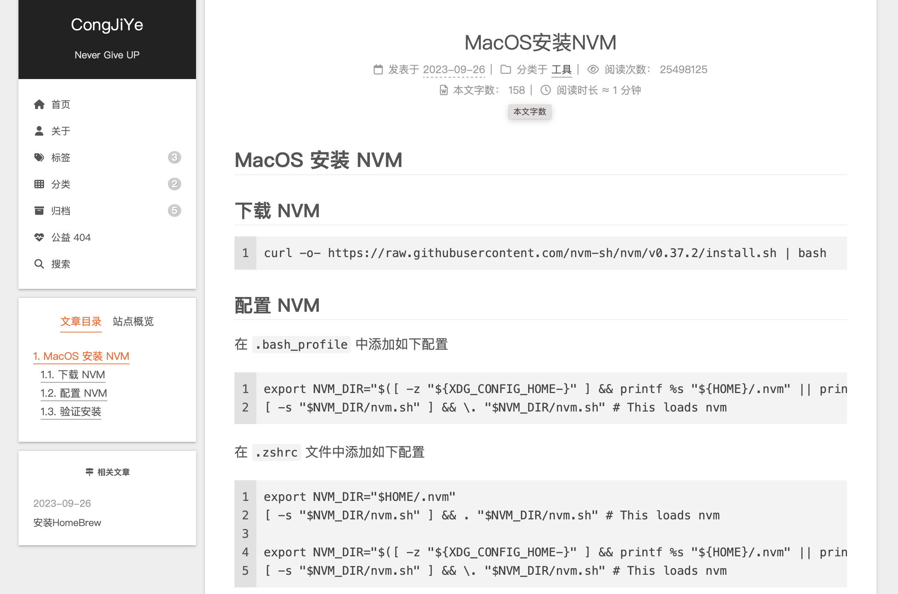

# BLOG

个人博客源码存放地址，使用如下技术栈搭建

- Hexo
- NexT
- Github Pages

## 主页

[博客地址](congjiye.github.io)

## TODO

- [X] 支持评论功能
- [X] 自定义 404 页面
- [X] 支持关联文章
- [X] 使用 github actions 自动部署
- [X] 使用华为云加速国内访问
- [X] 自定义域名
